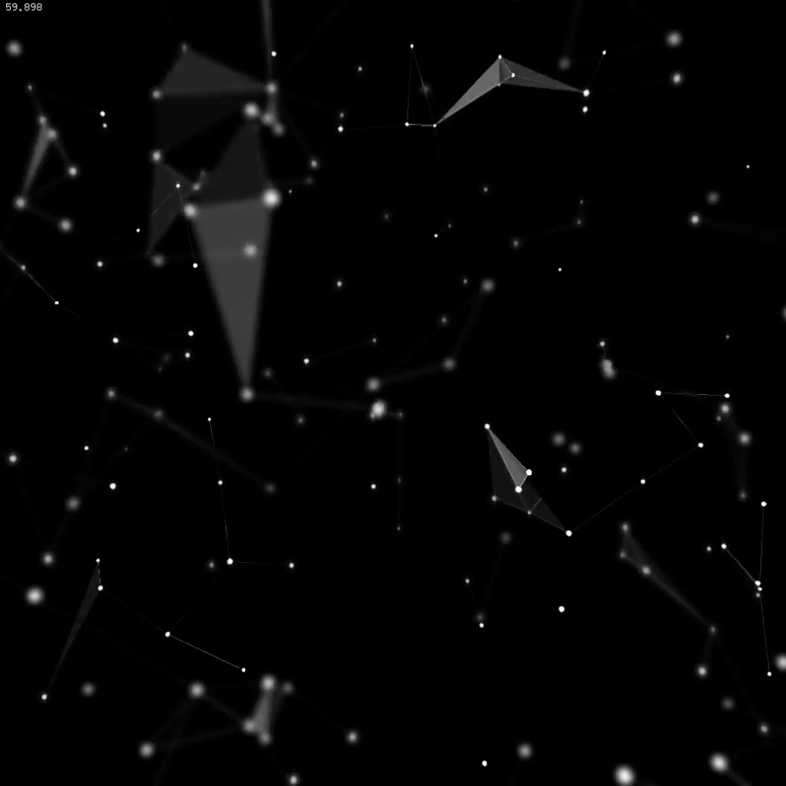

# Distance Lines
 Basically it's a vertices cloud that flows in a limited space with random attidudes :) Each vertex check its distance to other vertices in particle cloud. Vertices make a connection line according to predefined distance value. If there are more than 3 vertices in connection, they will build a triagular mesh. Line and triangle group's opacity also depends on the distance value. 

    

# Dependencies
[ofxDOF](https://github.com/obviousjim/ofxDOF) - depth of field. Works with GL(3,2). Didn't test the addon for GL(2,1). But it seems it is supported.

